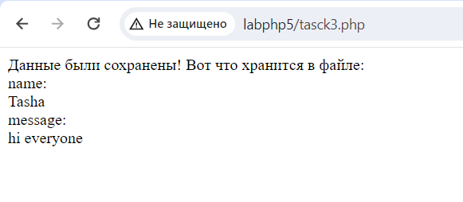
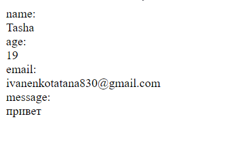

# ЛАБОРАТОРНАЯ РАБОТА №5-6 Обработка файлов и заголовки
## 1. Запись и чтение из файла

1.1. Проанализируйте следующий скрипт
```
<?php
//создание файла
$file = fopen("file.txt", "w") or die("Ошибка создания файла!");
//Вводим данные в файл
fwrite($file, "1. William Smith, 1990, 2344455666677\n");
fwrite($file, "2. John Doe, 1988, 4445556666787\n");
fwrite($file, "3. Michael Brown, 1991, 7748956996777\n");
fwrite($file, "4. David Johnson, 1987, 5556667779999\n");
fwrite($file, "5. Robert Jones, 1992, 99933456678888\n");
//Закрываем файл
fclose($file);
//Открываем файл для добавления данных
$file = fopen("file.txt", "a") or die("Ошибка открытия для добавления
данных!");
if (!$file) {
 echo("Не был найден файл для добавления данных!");
} else {
 // Добавьте в файл с помощью функции fwrite() еще 3 записи

}
fclose($file);
//Открываем файл для чтения из него
$file = fopen("file.txt", "r") or die("Ошибка открытия файла для чтения!");
if (!$file) {
 echo("Не был найден файл для чтения данных!");
} else { ?>
 <div>Данные из файла: </div>
 <?php
 while (!feof($file)) {
 echo fgets($file); ?>
 <br/>
 <?php
 }
 fclose($file);
}
```
* Этот код в переменной $file открывает для записи файл  с названием "file.txt", если файла с таким названием нет то создает новый.
При помощи команда "fwrite" записываюься данные в открытый файл. "fclose" закрывает файл.
Далее добавляет еще несколько записей в тот же файл, открывая его в режиме добавления (режим "a"). После проверки наличия файла, он использует функцию fwrite для добавления трех дополнительных записей. Закрываем файл. Открывает файл для чтения (режим "r") и выводит его содержимое в виде HTML-разметки. Для этого используется цикл while, который считывает строки из файла с помощью функции fgets. Код выполняет проверку на конец файла с помощью feof. После вывода каждой строки он добавляет тег <br/>, чтобы перейти на новую строку. Закрывает файл. 

1.2. Объясните, зачем необходимо закрывать файл fclose()
* Во- первых, при открытии файла операционная система отводит некоторое количество памяти для работы с ним. Если файл не закрыть явно, эти ресурсы могут оставаться занятыми даже после завершения работы программы. Во-вторых, закрытие файла гарантирует завершение всех операций записи и чтения, что важно для того, чтобы данные были записаны полностью и корректно сохранены на диске. В- третьих, предотвращение потери или записи некоректных данных.
1.3. Добавьте в файл с помощью функции fwrite() ещё 3 записи.
```
 fwrite($file, "6. Christopher Lee, 1995, 2223334445556\n");
    fwrite($file, "7. Emily Davis, 1998, 6667778889991\n");
    fwrite($file, "8. Jessica Martinez, 1993, 7778889990002\n");
```
## 2. Запись в файл с помощью функции file_get_contents()
2.1. В задании №1 замените функцию fwrite на file_put_contents()

2.2. Чем отличается функция fwrite и file_put_contents?
* С file_put_contents(), файл открывается, записывается и автоматически закрывается.
* С file_put_contents(), функция возвращает false в случае ошибки записи, но не нужно явно проверять возвращаемое значение, так как обработка ошибок уже встроена в функцию.
* file_put_contents(), будучи более удобной, может быть менее эффективной при работе с большими объемами данных, так как она выполняет всю работу по записи в файл за один вызов.
* file_put_contents() при добавлении данных полностью перезаписывает файл если не указать FILE_APPEND - добавить в конце файла.

# 3. Обработка форм и файлов
3.1. Проанализируйте следующий скрипт
```
<?php if (!isset($_REQUEST['start'])) { ?>
<form action="<?php echo $_SERVER['SCRIPT_NAME'] ?>" method="post">
 <div>
 <label>Ваше имя: <input name="name" type="text" size="30"></label>
 </div>
 <div>
 <label>Ваше мнение о нас напишите тут:
 <textarea name="message" cols="40" rows="4" placeholder="Ваше
мнение..."></textarea>
 </label>
 </div>
 <div>
 <input type="reset" value="Стереть"/>
 <input type="submit" value="Передать" name="start"/>
 </div>
</form>
<?php } else {
 // Данные с формы
 $data = [
 'name' => $_POST['name'] ?? "",
 'message' => $_POST['message'] ?? "",
 ];
 // Сохранение данных в файл
 $file = fopen('messages.txt', 'a+') or die("Недоступный файл!");
 foreach ($data as $field => $value) {
 // Добавьте код для сохранения данных в файл
 }
 fwrite($file, "\n");
 fclose($file);
 // Вывод данных на экран
 echo 'Данные были сохранены! Вот что хранится в файле: <br />';
 $file = fopen("messages.txt", "r") or die("Недоступный файл!");
 while (!feof($file)) {
 echo fgets($file) . "<br />";
 }
 fclose($file);
}
```
* `$_REQUEST['start']` - это глобальный массив в PHP, который содержит данные, переданные скрипту через HTTP запрос. Он объединяет данные из массивов $_GET, $_POST и $_COOKIE. 
* `$_SERVER['SCRIPT_NAME']` - это элемент массива $_SERVER в PHP, который содержит относительный путь к текущему исполняемому скрипту.
* Скрипт проверяет наличие параметра start в запросе. Если параметр установлен, значит, форма была отправлена. Затем данные из формы извлекаются из массива $_POST и сохраняются в ассоциативный массив $data. После этого данные добавляются в файл messages.txt.
* Вывод содеожимого файла на экран

3.2. Добавьте код, чтобы данные с формы сохранялись в файл


3.3. Добавьте еще 2 контроллера в форму и их верное сохранение в 

- Возраст (age), типа number.

- E-mail, типа email.



# 4. Регистрация и авторизация пользователей
4.1. Создайте HTML-форму регистрации с двумя полями: login (имя пользователя) и
password (пароль).

4.2. Напишите PHP-скрипт, который обрабатывает данные, отправленные с формы.

4.3. Скрипт должен:

- Проверить, что все поля заполнены.

- Зашифровать пароль пользователя с помощью функции md5().

- Сохранить данные пользователя в текстовый файл (например, users.txt) в
формате: login:password.

4.4. При успешной регистрации отправьте пользователю HTTP-код 201 (Created).
Объясните, для чего используются HTTP-коды.
*  Они предоставляют информацию о результате выполнения запроса или статусе сервера. 

4.4. Создайте HTML-форму авторизации с двумя полями: login (имя пользователя) и
password (пароль).

4.5. Напишите PHP-скрипт, который обрабатывает данные, отправленные с формы.

4.6. Скрипт должен:

- Проверить, что все поля заполнены.

- Проверить, существует ли пользователь с таким логином и паролем в файле
users.txt.

- Если пользователь не найден, вывести сообщение об ошибке.

- Если пользователь найден, перенаправить его на страницу с изображениями
(например, images.php) с помощью функции header().

Внизу будут показаны некоторые исходники (примеры) для создания скрипта
регистрации и авторизации. Вы можете написать свои скрипты.


